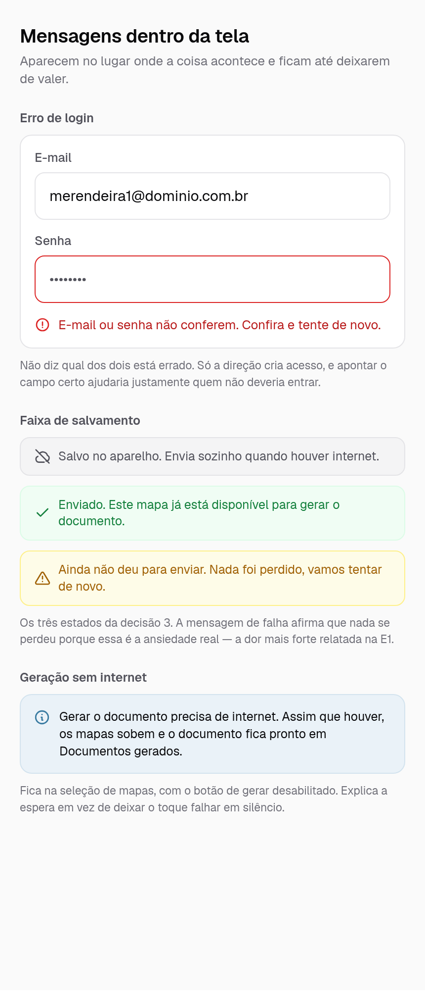
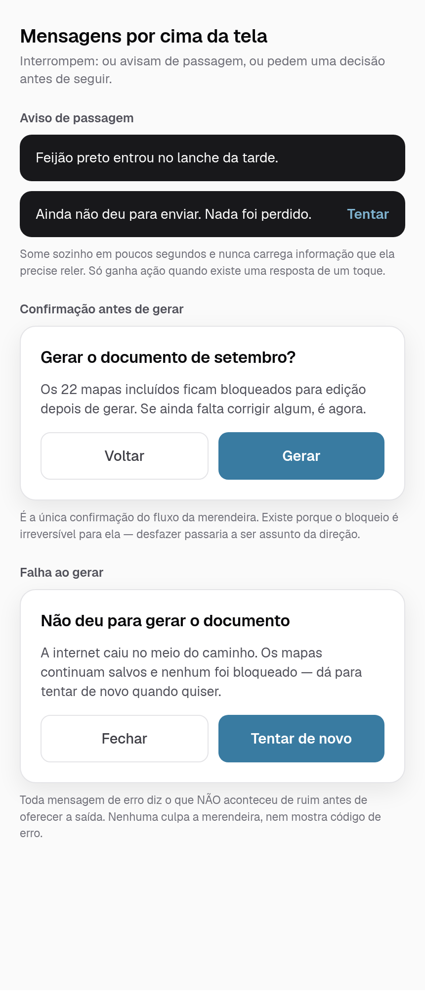
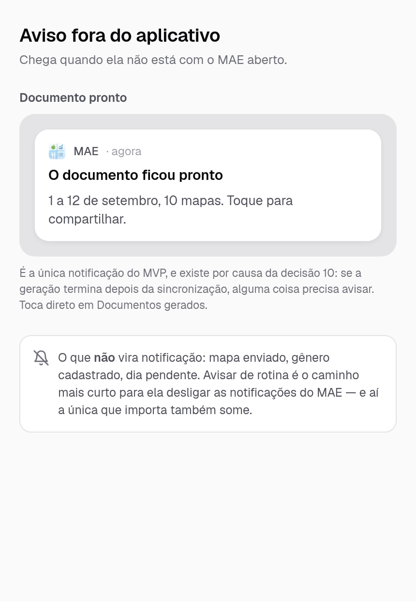

# Avisos e mensagens — MAE

> Etapa E3 (refs #32). Catálogo do que aparece **por cima** das telas: erros, confirmações, avisos de passagem e a notificação do sistema. As telas do fluxo estão em [telas.md](telas.md); o porquê de cada escolha, em [decisoes-de-design.md](decisoes-de-design.md).
>
> É um catálogo de mensagens, não só de componentes: o texto exato faz parte da decisão. Toda a linguagem do aplicativo sai daqui.

## As três regras da linguagem

1. **Nenhuma mensagem culpa a merendeira.** O erro é do aplicativo, da internet ou do fornecedor — nunca dela. Não existe "você esqueceu", "campo obrigatório não preenchido", nem código de erro na tela.
2. **Erro diz primeiro o que não se perdeu.** A dor mais forte relatada na E1 foi perder preenchimento. Antes de oferecer a saída, a mensagem afirma o que continua salvo.
3. **Nada de jargão.** "Salvo no aparelho", não "cache local". "Enviado", não "sincronizado". "Sai do ar em 9 de setembro", não "expira em D+7".

## Mensagens dentro da tela

Ficam no lugar onde a coisa acontece e permanecem enquanto valem. O erro de login não diz qual dos dois campos está errado: só a direção cria acesso (US016), e apontar o campo certo ajudaria justamente quem não deveria entrar.

## Mensagens por cima da tela

Duas naturezas diferentes: o **aviso de passagem** some sozinho e nunca carrega informação que precise ser relida; o **diálogo** interrompe e exige uma decisão.

A confirmação antes de gerar é a única do fluxo da merendeira, e existe porque o bloqueio dos mapas é irreversível para ela — depois de gerado, corrigir passaria a ser assunto da direção. Confirmar tudo é o caminho para ela deixar de ler as confirmações.

## Fora do aplicativo

Uma única notificação no MVP: **documento pronto**. Ela decorre da [decisão 10](decisoes-de-design.md) — se a geração pode terminar depois da sincronização, e a merendeira não fica presa esperando na tela, algo precisa avisar quando terminar. Toca direto na tela de documentos gerados.

Mapa enviado, gênero cadastrado e dia pendente **não** viram notificação. Avisar de rotina é o caminho mais curto para ela desligar as notificações do MAE — e aí a única que importa também some.
