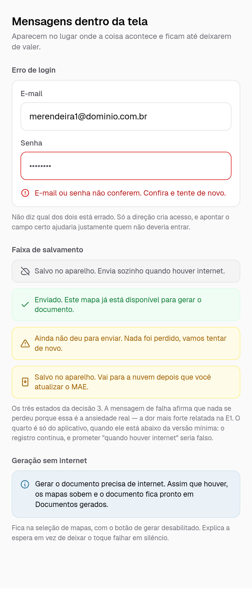
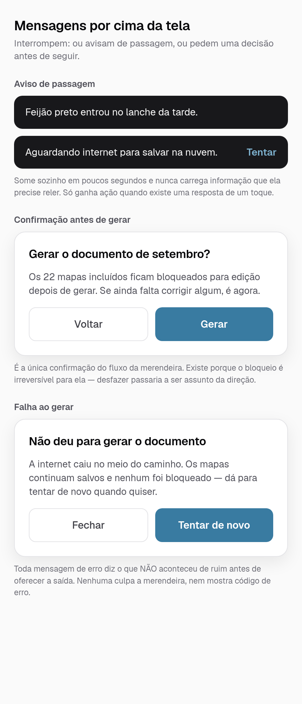
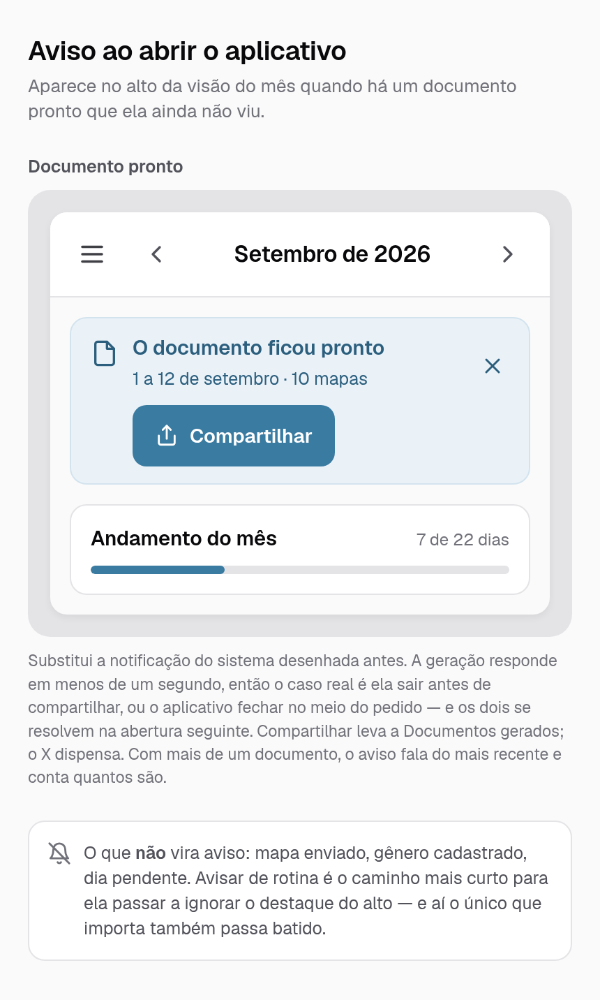

# Avisos e mensagens — MAE

> Etapa E3 (refs #32). Catálogo do que aparece **por cima** das telas: erros, confirmações, avisos de passagem e o aviso de documento pronto. As telas do fluxo estão em [telas.md](telas.md); o porquê de cada escolha, em [decisoes-de-design.md](decisoes-de-design.md).
>
> É um catálogo de mensagens, não só de componentes: o texto exato faz parte da decisão. Toda a linguagem do aplicativo sai daqui.

## As três regras da linguagem

1. **Nenhuma mensagem culpa a merendeira.** O erro é do aplicativo, da internet ou do fornecedor — nunca dela. Não existe "você esqueceu", "campo obrigatório não preenchido", nem código de erro na tela.
2. **Erro diz primeiro o que não se perdeu.** A dor mais forte relatada na E1 foi perder preenchimento. Antes de oferecer a saída, a mensagem afirma o que continua salvo.
3. **Nada de jargão.** "Salvo no aparelho", não "cache local". "Enviado", não "sincronizado". "Sai do ar em 9 de setembro", não "expira em D+7".

## Mensagens dentro da tela

Ficam no lugar onde a coisa acontece e permanecem enquanto valem. O erro de login não diz qual dos dois campos está errado: só a direção cria acesso (US016), e apontar o campo certo ajudaria justamente quem não deveria entrar.

## Mensagens por cima da tela

Duas naturezas diferentes: o **aviso de passagem** some sozinho e nunca carrega informação que precise ser relida; o **diálogo** interrompe e exige uma decisão.

A confirmação antes de gerar é a única do fluxo da merendeira, e existe porque o bloqueio dos mapas é irreversível para ela — depois de gerado, corrigir passaria a ser assunto da direção. Confirmar tudo é o caminho para ela deixar de ler as confirmações.

## Ao abrir o aplicativo

Um único aviso de destaque no MVP: **documento pronto**. Aparece no alto da visão do mês quando a merendeira abre o aplicativo e há um documento que ficou pronto e que ela ainda não viu, com "Compartilhar", que leva à tela do documento, e um X para dispensar. Com mais de um, o aviso fala do mais recente e conta quantos são.

> **Revisado na E6 (refs #110).** A E3 desenhou aqui uma **notificação do sistema**, que chegaria com o aplicativo fechado. Ela decorria da [decisão 10](decisoes-de-design.md) — se a geração pode terminar depois da sincronização, e a merendeira não fica presa esperando na tela, algo precisa avisar quando terminar. A premissa não se sustentou: a geração responde em menos de um segundo, e o caso real é ela sair antes de compartilhar, ou o aplicativo fechar no meio do pedido. Os dois se resolvem na abertura seguinte, e é nela que o aviso aparece. O push custaria o Firebase, o registro do aparelho e uma migration, para avisar de uma coisa que ela mesma acabou de pedir — ver a [decisão 10 da E6](../06-app/decisoes-tecnicas.md#10-documento-pronto-é-aviso-ao-abrir-não-notificação-por-push). O desenho original, a notificação com "agora" e o toque que abria Documentos gerados, saiu deste catálogo; a história do aviso está no [relato da E6](../06-app/aviso-de-documento-pronto.md).

O texto segue a mesma frase que a notificação tinha — "O documento ficou pronto" —, com o período e a quantidade de mapas embaixo.

Mapa enviado, gênero cadastrado e dia pendente **não** viram aviso. Avisar de rotina é o caminho mais curto para ela passar a ignorar o destaque do alto — e aí o único que importa também passa batido.
