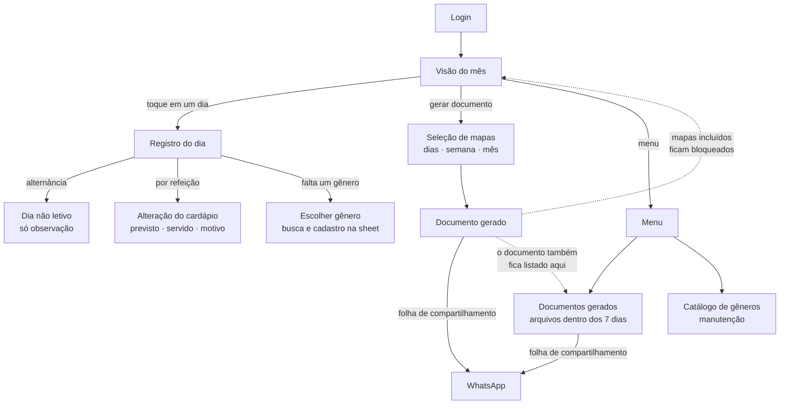
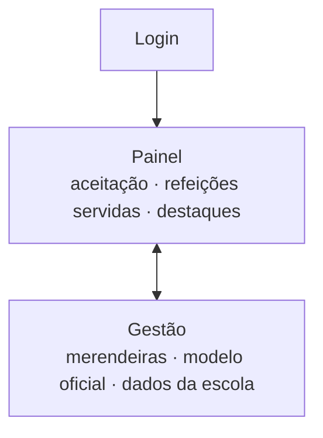

# Fluxo de telas — MAE

> Etapa E3 do projeto (refs #24). Mapa de navegação entre as telas do MVP, cobrindo as histórias de prioridade A e B do [backlog](../02-requisitos/backlog.md). Os wireframes/mockups correspondentes entram em `docs/assets/` na conclusão da etapa.

## Princípio: mobile-first, um fluxo só

O produto é usado no celular (registro em casa, sem sinal de operadora), mas o cronograma entrega a web antes (E5) e o app Android depois (E6). Para não desenhar — e implementar — duas experiências, as telas da merendeira são projetadas em largura de celular e a web as apresenta como o mesmo fluxo responsivo. A única área com layout próprio de desktop é a do administrador, que é uso de direção, em computador.

## Fluxo da merendeira

- **Login** é a única porta de entrada: não há autocadastro — o acesso é criado pela direção (US016).
- **Visão do mês** é a tela-casa: mostra o estado de cada dia e concentra os dois caminhos (registrar um dia, gerar documento).
- **Dia não letivo** e **alteração do cardápio** não são telas de fluxo separado: são estados/etapas dentro do registro do dia, para o caminho feliz continuar curto.
- **Escolher gênero** é um sheet que sobe por cima do registro, não uma tela de destino: a busca no catálogo e o cadastro de um gênero novo (nome + unidade padrão) acontecem ali dentro, e o item cadastrado já entra na refeição — é o que a US009 exige ao dizer "sem sair do fluxo" (CA#2) e "busca por nome no catálogo durante o registro" (RNF#1).
- **Menu** é a porta lateral do que não pertence ao fluxo diário: documentos gerados, manutenção do catálogo e (na revisão) o tema escuro. Sem ele, essas telas não teriam de onde ser abertas — o fluxo do mapa não tem lugar natural para elas.
- **Documentos gerados** existe porque a tela 6 é um beco: saindo dela, um documento já gerado ficaria inalcançável até expirar. Lista as gerações ainda dentro da janela de 7 dias, com a ação de compartilhar de novo.
- **Catálogo de gêneros** deixa de ser destino do registro e fica só para manutenção (renomear, desativar, conferir unidades), alcançado pelo menu.

## Fluxo do administrador

O admin consulta tudo, mas não registra mapa (decisão da E2): o fluxo do documento é inteiro das merendeiras.

## Rastreio tela → histórias

| Tela | Histórias | Estados que apresenta |
|---|---|---|
| Login | US016 (acesso gerido pelo admin) | — |
| Visão do mês | US008, US007 | vazio · parcial · completo · não letivo · bloqueado |
| Registro do dia | US001, US003, US004, US005, US009, US010 | refeição vazia · parcial · preenchida; salvamento local/enviado |
| Dia não letivo (estado do registro) | US006 | — |
| Alteração do cardápio | US002 | — |
| Escolher gênero (sheet do registro) | US009, US003 | lista do catálogo · cadastro de gênero novo |
| Menu | requisito de design (E3) | — |
| Documentos gerados | US012, US014 + requisito de design (E3) | disponível · sai amanhã · fora do ar |
| Catálogo de gêneros | US009 | — |
| Seleção de mapas | US013, US007 | selecionável · pendente · sem registro (desabilitado) |
| Documento gerado | US012, US014, US007 | expiração do link · aviso de bloqueio |
| Admin · Painel | US017 | — |
| Admin · Gestão | US015, US016 | — |

A confiabilidade offline (US010/US011) não tem tela própria: atravessa todas as telas da merendeira como faixa de estado e linguagem de salvamento — ver [decisões de design](decisoes-de-design.md).

## Telas que não vieram do levantamento

Duas telas deste mapa não têm história de origem na E2: o **Menu** e os **Documentos gerados**. Elas não nasceram de uma dor relatada nas entrevistas — nasceram do próprio desenho, quando o fluxo desenhado mostrou buracos que a conversa não tinha revelado: a manutenção do catálogo não tinha porta, e o documento gerado desaparecia ao sair da tela 6 (basta o app fechar durante o compartilhamento, ou a geração terminar depois da sincronização, para o arquivo ficar inalcançável até expirar).

É comportamento esperado da etapa: o levantamento produz as histórias, e a prototipação revela os requisitos que só aparecem quando alguém tenta percorrer o fluxo inteiro. Ficam registrados aqui como requisitos de design e entram no backlog na revisão da documentação, com a origem declarada — não como se sempre tivessem estado lá.
