# Telas do MVP — MAE

> Etapa E3 (refs #26, #27, #28). Exportação das telas desenhadas na etapa, em PNG a 2×, para uso na documentação e no relatório da faculdade. O mapa de navegação está em [fluxo-de-telas.md](fluxo-de-telas.md) e o porquê de cada escolha em [decisoes-de-design.md](decisoes-de-design.md).
>
> As telas da merendeira são desenhadas em largura de celular (390 px) e valem para a web (E5) e para o app (E6); a área do administrador tem layout de desktop (1440 px). Os nomes de pessoas, e-mails e números aqui são fictícios.

## Fluxo da merendeira

### 1 · Login

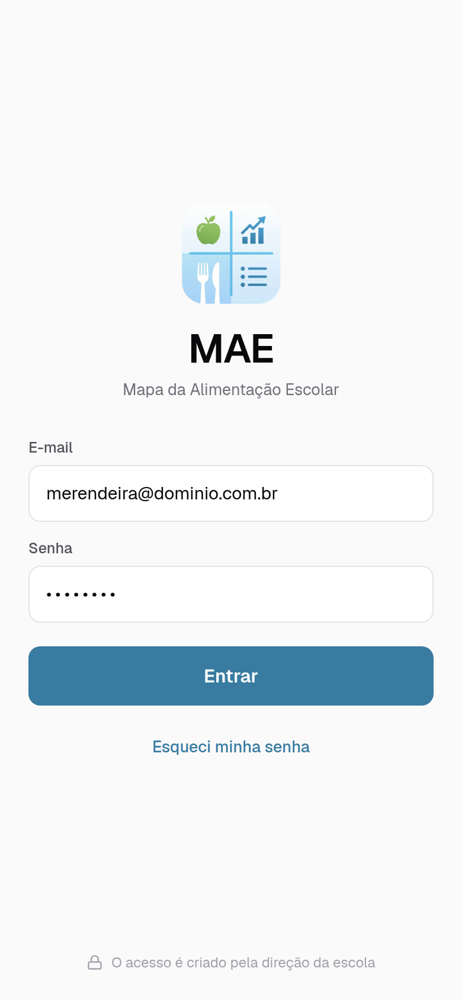

Única porta de entrada: não há autocadastro, o acesso é criado pela direção. **US016.**

### 2 · Visão do mês

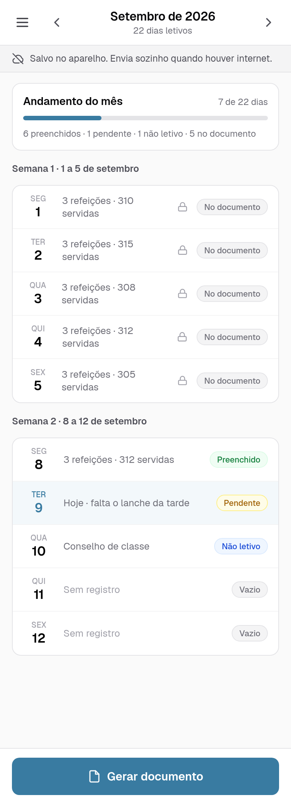

A tela-casa: estado de cada dia (vazio, pendente, completo, não letivo, no documento), andamento do mês e os dois caminhos — registrar um dia e gerar o documento. O botão de menu no cabeçalho abre o que não é fluxo diário. **US008, US007.**

### 2a · Menu

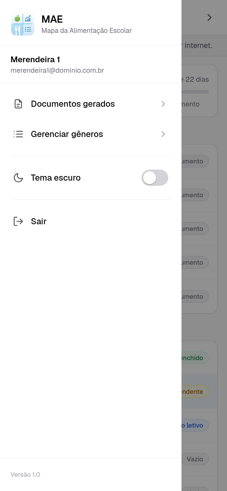

Documentos gerados, manutenção do catálogo, tema escuro e sair. **Requisito de design da E3** — ver [decisão 9](decisoes-de-design.md).

### 2b · Documentos gerados

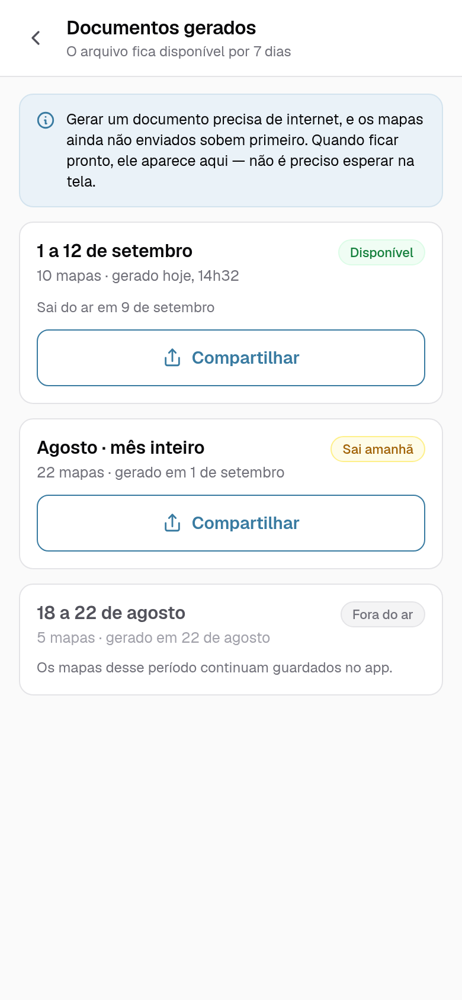

Os documentos ainda dentro da janela de 7 dias, com o período, quantos mapas contêm, quando saem do ar e a ação de compartilhar de novo. Existe porque a tela do documento gerado, sozinha, é um beco. **US012, US014** + requisito de design da E3 — ver [decisão 10](decisoes-de-design.md).

### 3 · Registro do dia

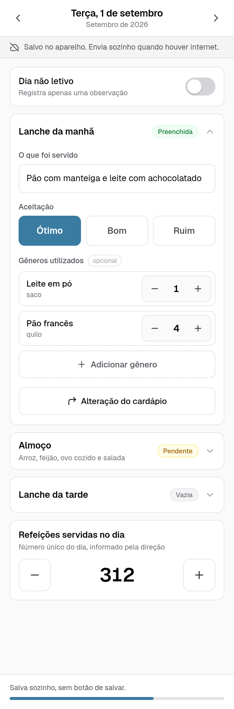

As três refeições em cartões expansíveis, com aceitação em três botões, gêneros opcionais com stepper de inteiros, o número único de refeições do dia e a alternância de dia não letivo. Não há botão de salvar: a faixa do topo diz o estado do salvamento. **US001, US003, US004, US005, US009, US010.**

### 3 · Registro do dia — refeição com alteração do cardápio

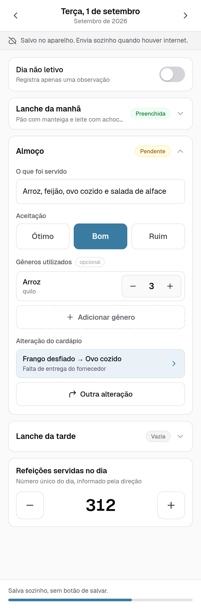

Segundo estado da mesma tela: registrada a troca, ela aparece dentro do cartão da refeição — item previsto, item servido e motivo —, porque é isso que sai no documento oficial. **US002, US007.**

### 3a · Alteração do cardápio

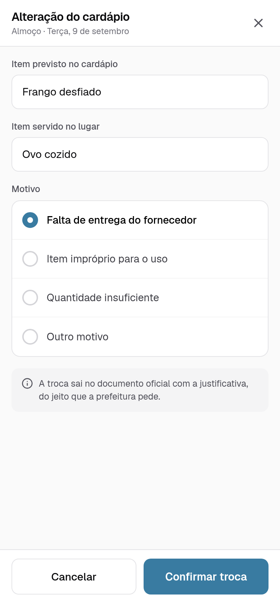

Item previsto, item servido e o motivo da troca. **US002.**

### 3b · Escolher gênero

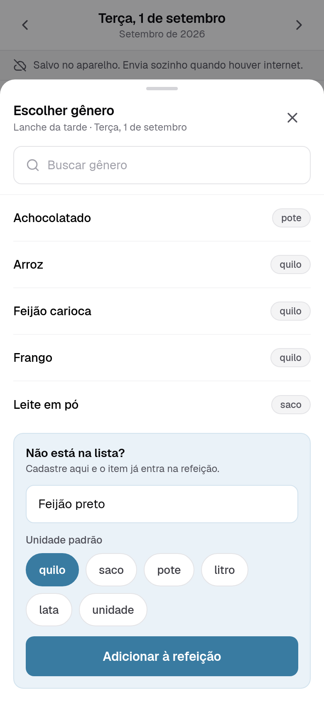

Sheet sobre o registro: busca no catálogo e, no fim da lista, o cadastro de um gênero novo com a sua unidade padrão — o item cadastrado já entra na refeição, sem sair do dia. **US009, US003.**

### 4 · Catálogo de gêneros

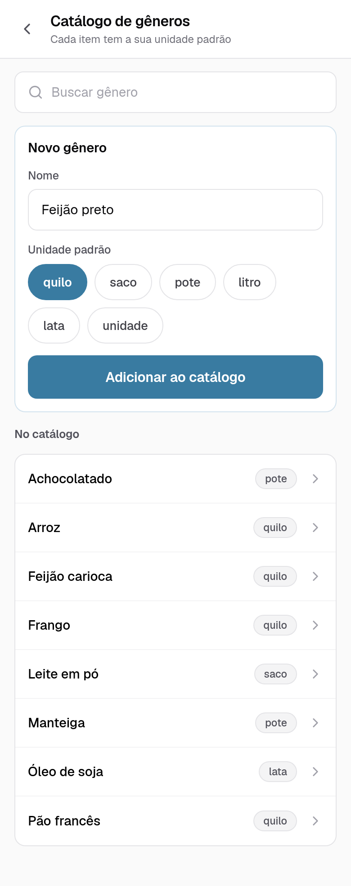

Manutenção do catálogo, alcançada pelo menu: cada item com a sua unidade padrão. **US009.**

### 5 · Seleção de mapas

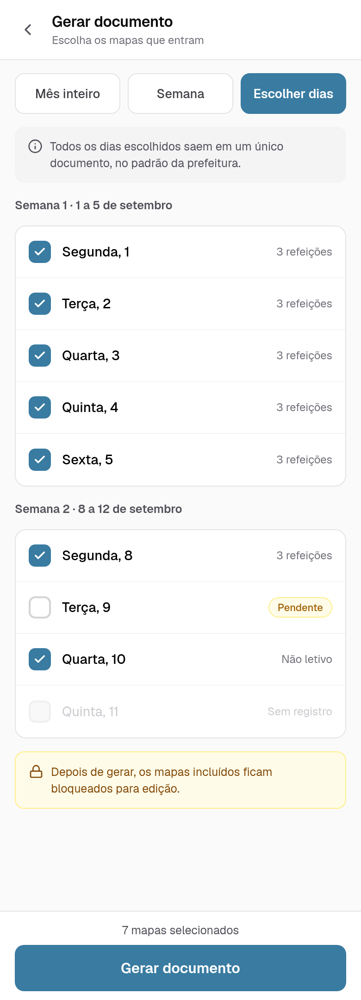

Dias avulsos, semana ou mês inteiro para um documento único, com o aviso de que os mapas incluídos ficam bloqueados. **US013, US007.**

### 6 · Documento gerado

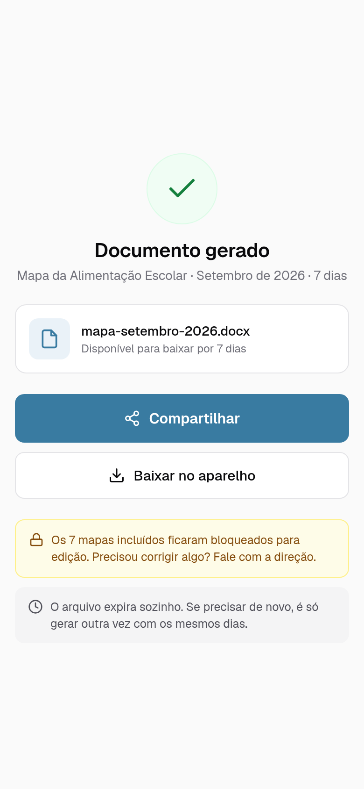

O documento pronto e o compartilhamento pela folha do Android. **US012, US014, US007.**

## Área do administrador

### Painel

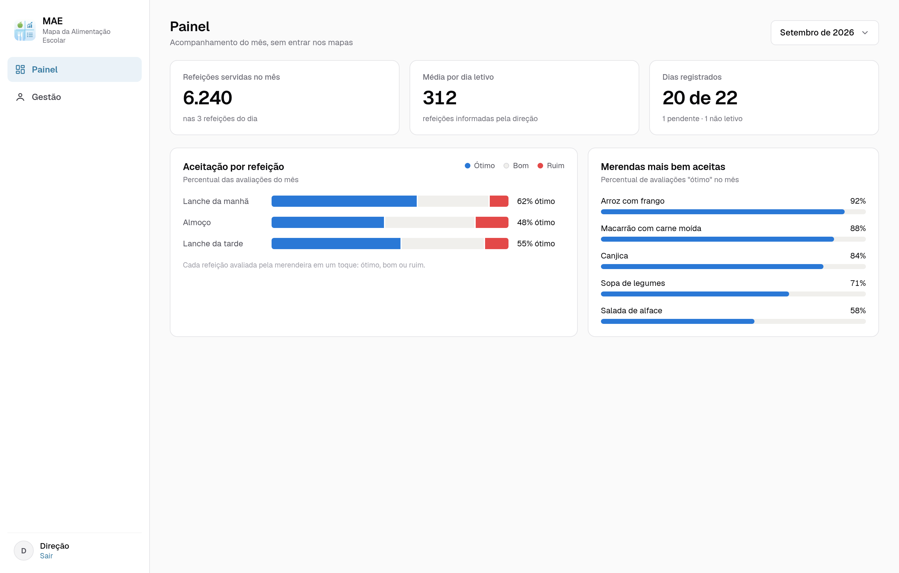

Histórico mensal: aceitação das refeições, refeições servidas e as merendas mais bem aceitas. **US017.**

### Gestão

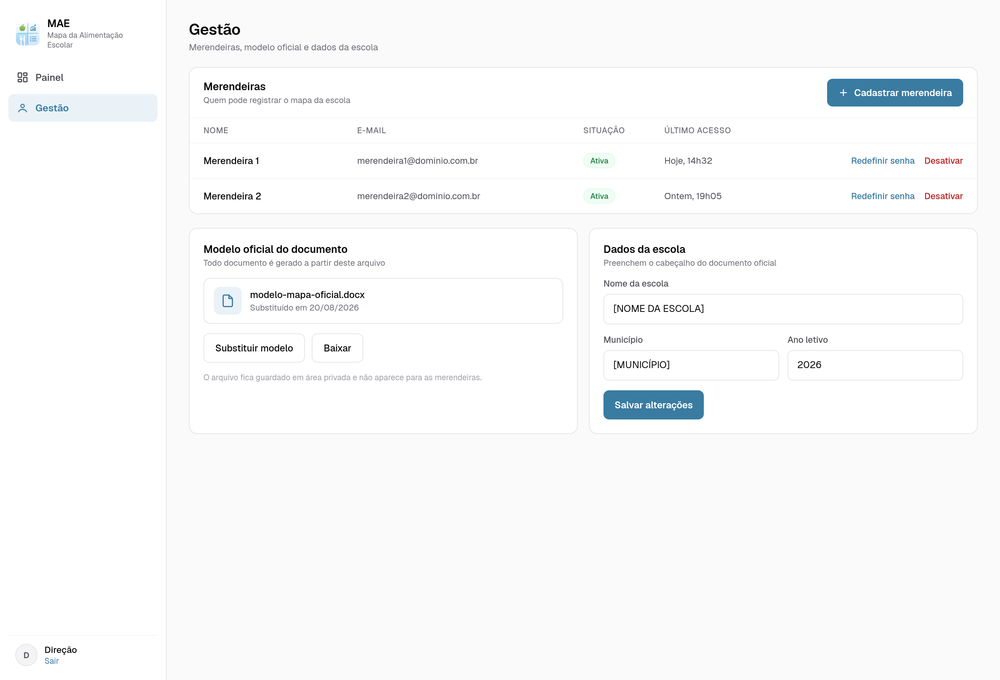

Merendeiras e acessos, modelo oficial do mapa e dados da escola. **US015, US016.**

## Sobre estes arquivos

As telas são desenhadas num canvas de design e exportadas daqui em PNG, cada uma no tamanho do seu artboard e a 2× para não perder nitidez ao entrar no documento da faculdade. As imagens não são editadas à mão: quando uma tela muda, o arquivo é exportado de novo.
