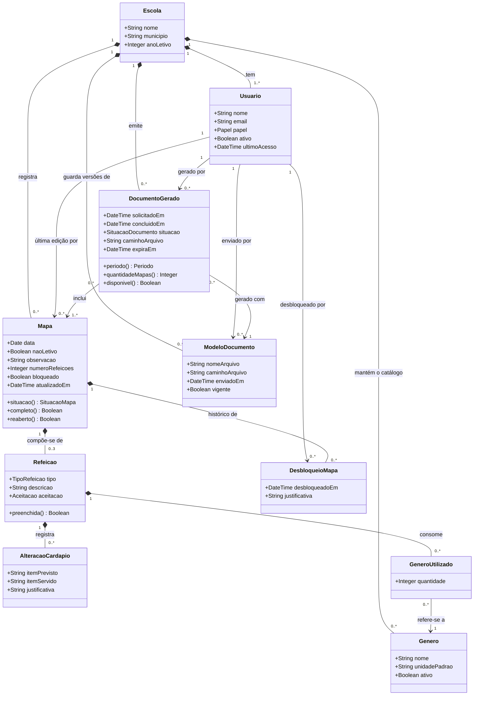
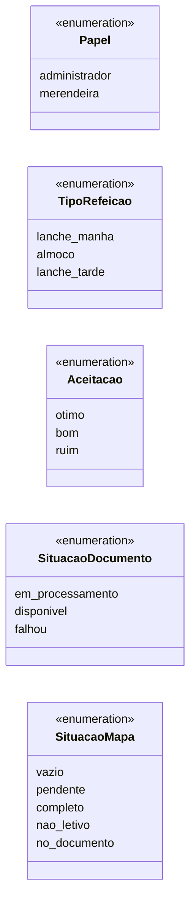

# Diagrama de classes — MAE

> Etapa E4 do projeto (refs #39). Primeiro artefato da modelagem de dados: as classes do domínio, seus atributos e relacionamentos, derivados das [histórias de usuário](../02-requisitos/historias-de-usuario.md) da E2 e das [decisões de design](../03-ux/decisoes-de-design.md) da E3. É deste diagrama que derivam, em sequência, o modelo conceitual, o modelo ER e o projeto físico. O porquê das escolhas que o diagrama não explica sozinho está em [decisoes-de-modelagem.md](decisoes-de-modelagem.md).
>
> Nomes de escola, pessoas e e-mails usados como exemplo são fictícios.

## O domínio em uma frase

Uma **escola** tem **usuários** (administrador e merendeiras) e um **catálogo de gêneros**. Cada dia do calendário pode ter um **mapa**: letivo, com exatamente três **refeições** (cada uma com o que foi servido, a aceitação, os **gêneros utilizados** e as eventuais **alterações do cardápio**) e o número de refeições do dia; ou não letivo, só com observação. A merendeira escolhe mapas e o sistema gera um **documento** a partir do **modelo oficial** vigente; os mapas incluídos ficam bloqueados até que o administrador registre um **desbloqueio**.

## Diagrama

### Enumerações

Os tipos fechados usados acima. `SituacaoMapa` não é gravada: é o resultado de `Mapa.situacao()` (ver "Estados do dia").

## As classes

### Escola

Dados institucionais que saem no cabeçalho do documento oficial: nome, município e ano letivo. É a raiz de tudo o mais — usuários, catálogo, mapas e documentos pertencem a uma escola —, e é por ela que o banco separa o que cada perfil pode ver (RN#2 da US016). O MVP atende uma única escola, mas o modelo não a fixa. **US015.**

### Usuario

Quem entra no sistema. As credenciais ficam no serviço de autenticação; a classe guarda o que é do domínio: nome, e-mail, papel (`administrador` ou `merendeira`), se o acesso está ativo e o último acesso. Um usuário desativado não é apagado — os mapas e documentos que ele produziu continuam apontando para ele (CA#2 da US016). O papel decide o que cada um faz: a merendeira registra e gera; o administrador consulta, gerencia acessos, o modelo oficial e os dados da escola, e desbloqueia mapas. **US016, US015, US023.**

### Genero

Um item do catálogo de gêneros alimentícios da escola, com a sua unidade padrão (quilo, saco, pote, lata, litro, unidade…). A unidade mora aqui, e não em cada uso, para que toda quantidade registrada seja consistente (decisão 2 da E3). Um gênero que já foi usado em algum mapa não pode ser excluído, apenas desativado (CA#3 da US009). **US009, US003.**

### Mapa

O registro de um dia — o que a documentação chama de "mapa do dia". Existe no máximo um por data em cada escola. Ou é letivo, e então tem as três refeições e o número único de refeições do dia (US005), ou é não letivo, e então só a observação importa (US006). Guarda também se está **bloqueado** por ter entrado em documento gerado (RN#1 da US007) e quem fez a última edição, o que sustenta a convergência entre aparelhos da US011.

Os três métodos são derivações, não dados armazenados:

- `completo()` — dia letivo com número de refeições informado e as três refeições preenchidas (gêneros continuam opcionais — RN#3 da US001).
- `reaberto()` — não está bloqueado e já teve pelo menos um desbloqueio: é o mapa "reaberto para correção" do CA#2 da US023.
- `situacao()` — o estado que a visão do mês mostra (ver "Estados do dia" abaixo).

**US001, US005, US006, US007, US008, US011, US023.**

### Refeicao

Uma das três refeições de um dia letivo: lanche da manhã, almoço ou lanche da tarde (RN#1 da US001) — o tipo é fixo e não se repete no mesmo mapa. Guarda a descrição do que foi servido, em texto livre, do jeito que sai na linha da refeição no documento oficial, e a aceitação em três graus (US004). `preenchida()` é verdadeira quando descrição e aceitação existem. **US001, US004.**

### AlteracaoCardapio

Uma troca em relação ao cardápio oficial dentro de uma refeição: item previsto, item servido no lugar e a justificativa, obrigatória (RN#1 da US002). Uma refeição pode ter mais de uma — é o botão "Outra alteração" da decisão 8 da E3. **US002.**

### GeneroUtilizado

A ligação entre uma refeição e um gênero do catálogo, com a quantidade em número inteiro na unidade padrão do gênero (RN#1 da US003). Cada gênero aparece no máximo uma vez por refeição. **US003, US009.**

### ModeloDocumento

Uma versão do modelo oficial do documento, enviada pelo administrador. O arquivo em si fica em armazenamento privado (RNF#1 da US012); a classe guarda o caminho, quando foi enviado e se é a versão vigente — existe sempre exatamente uma vigente por escola (RN#1 da US015). As versões anteriores não são apagadas, para que cada documento gerado saiba com qual modelo saiu. **US015, US012.**

### DocumentoGerado

O registro de cada geração: quem pediu, quando, com qual modelo, quais mapas entraram, a situação (`em_processamento`, `disponivel` ou `falhou`), o caminho do arquivo e quando ele sai do ar. O registro é permanente; o arquivo, não — expira em até 7 dias (RN#2 da US012), e `disponivel()` diz se ainda pode ser baixado. `periodo()` e `quantidadeMapas()` derivam dos mapas incluídos, que é o que a lista de documentos gerados mostra. **US012, US013, US021, US022.**

### DesbloqueioMapa

O ato do administrador de reabrir um mapa bloqueado: quem, quando e por quê (CA#3 da US023). É histórico permanente (RNF#1 da US023) e não apaga o documento que motivou o bloqueio (RN#2 da US023). **US023.**

## Estados do dia

A [decisão 4 da E3](../03-ux/decisoes-de-design.md) fixou cinco estados para um dia, todos visíveis na visão do mês. Só um deles é armazenado; os outros derivam do que o mapa contém:

| Estado (`SituacaoMapa`) | Origem no modelo |
|---|---|
| `vazio` | Não existe `Mapa` para a data. |
| `nao_letivo` | `Mapa.naoLetivo` é verdadeiro. |
| `no_documento` | `Mapa.bloqueado` é verdadeiro — armazenado, porque quem o muda é o servidor (na geração) ou o administrador (no desbloqueio), nunca a merendeira. |
| `completo` | `Mapa.completo()`: número de refeições informado e as três refeições preenchidas. |
| `pendente` | Todo mapa letivo, não bloqueado, que ainda não está completo. |

Um mapa reaberto (`reaberto()`) aparece como `pendente` ou `completo`, com a sinalização adicional de que foi reaberto para correção.

## O que não é classe

- **Cardápio oficial** — documento externo, de referência; não é objeto do sistema no MVP (US019, pós-MVP). O mapa nunca depende dele.
- **Tema escuro e demais preferências** — escolha de cada usuária, no aparelho (RN#1 da US024); não vai ao banco.
- **O arquivo do documento gerado** — vive no armazenamento, temporário; o banco guarda só o registro da geração e o caminho.
- **Motivos sugeridos da alteração** e **unidades sugeridas do gênero** — listas da interface para reduzir digitação (RNF#1 da US002); o dado gravado é texto.
