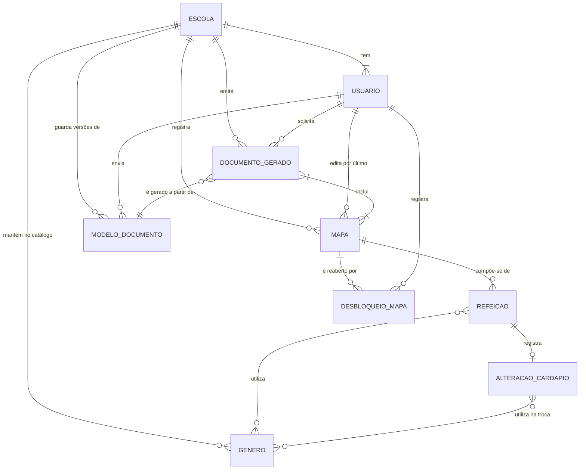

# Modelo conceitual — MAE

> Etapa E4 do projeto (refs #40). Segundo artefato da modelagem: as entidades do domínio, seus atributos e os relacionamentos entre elas, com cardinalidade. É a leitura do [diagrama de classes](diagrama-de-classes.md) na linguagem de banco de dados, ainda **sem decisão de implementação** — não há tipo de coluna, chave técnica nem tabela de ligação aqui. Essas escolhas entram no [modelo ER](modelo-er.md).
>
> O porquê de cada escolha está em [decisoes-de-modelagem.md](decisoes-de-modelagem.md); as regras citadas (RN, CA, RNF) são das [histórias de usuário](../02-requisitos/historias-de-usuario.md).

## Diagrama

## As entidades

### ESCOLA

O que identifica a instituição no documento oficial e o que delimita o que cada pessoa enxerga.

| Atributo | Descrição |
|---|---|
| nome | Nome da escola, como sai no cabeçalho do documento. |
| município | Município da escola, também impresso no documento. |
| ano letivo | Ano de referência exibido na área de gestão. |

**US015.** No MVP existe uma única escola, mas ela é entidade e não configuração — ver [decisão 1](decisoes-de-modelagem.md).

### USUARIO

Quem entra no sistema. Guarda o que é do domínio; senha e sessão pertencem ao serviço de autenticação ([decisão 2](decisoes-de-modelagem.md)).

| Atributo | Descrição |
|---|---|
| nome | Nome exibido na gestão de acessos e na autoria dos registros. |
| e-mail | Identificação do login, criada pelo administrador (não há autocadastro — CA#3 da US016). |
| papel | `administrador` ou `merendeira`; decide o que a pessoa pode fazer (RN#1 da US016). |
| ativo | Acesso desativado sem apagar o que a pessoa registrou (CA#2 da US016). |
| último acesso | Informação de acompanhamento na tela de gestão. |

**US016, US015, US023.**

### GENERO

Um item do catálogo de gêneros alimentícios da escola.

| Atributo | Descrição |
|---|---|
| nome | Nome do gênero (arroz, leite em pó, manteiga). Único dentro da escola. |
| unidade padrão | A unidade em que aquele item é sempre contado: quilo, saco, pote, lata, litro, unidade (RN#1 da US009). |
| ativo | Gênero já usado não é excluído, apenas desativado (CA#3 da US009). |

**US009, US003.**

### MAPA

O registro de um dia — a unidade que a merendeira preenche e que entra no documento.

| Atributo | Descrição |
|---|---|
| data | O dia registrado. Único dentro da escola: existe no máximo um mapa por data. |
| não letivo | Marca o dia sem atendimento; quando verdadeira, só a observação importa (RN#1 da US006). |
| observação | Texto do dia não letivo (ex.: conselho de classe), obrigatório nesse caso (CA#2 da US006). |
| número de refeições | Valor único do dia, aplicado às três refeições (RN#1 da US005). |
| bloqueado | Verdadeira quando o mapa entrou em documento gerado; impede a edição pela merendeira (RN#1 da US007). |
| última edição em / por | Quando e por quem o dia foi alterado pela última vez — base da convergência entre aparelhos (CA#3 da US011). |

**US001, US005, US006, US007, US008, US011, US023.** Os estados que a visão do mês mostra (vazio, pendente, completo, não letivo, no documento) não são atributos: derivam do conteúdo do mapa, exceto o bloqueio — ver [decisão 4](decisoes-de-modelagem.md).

### REFEICAO

Uma das três refeições de um dia letivo.

| Atributo | Descrição |
|---|---|
| tipo | `lanche da manhã`, `almoço` ou `lanche da tarde`; não se repete no mesmo mapa (RN#1 da US001). |
| descrição | O cardápio previsto para aquele período, em texto livre — a linha transcrita do cardápio, como sai no documento ([decisão 6](decisoes-de-modelagem.md)). Permanece fiel ao previsto mesmo quando houve troca. |
| aceitação | `ótimo`, `bom` ou `ruim`, por refeição (RN#1 da US004). |

**US001, US004.**

### ALTERACAO_CARDAPIO

O registro de que a refeição saiu diferente do previsto. Existe no máximo uma por refeição.

| Atributo | Descrição |
|---|---|
| justificativa | O motivo, em texto livre e obrigatório (RN#1 da US002). Cobre a modificação inteira, não um item de cada vez. |

Os gêneros e quantidades usados na troca vêm do relacionamento **utiliza na troca** com GENERO. **Não existe atributo para o item substituído**: o formulário oficial não o pede, e a refeição continua descrevendo o cardápio previsto — é essa permanência que dá sentido à justificativa. **US002, US003.**

### MODELO_DOCUMENTO

Uma versão do modelo oficial enviada pelo administrador. O arquivo fica em armazenamento privado; a entidade guarda a referência a ele.

| Atributo | Descrição |
|---|---|
| nome do arquivo | Como o arquivo aparece na tela de gestão. |
| localização do arquivo | Onde ele está no armazenamento privado (RNF#1 da US012). |
| enviado em | Data do envio, exibida como "substituído em". |
| vigente | Marca a versão em uso; existe exatamente uma por escola (RN#1 da US015). |

**US015, US012.**

### DOCUMENTO_GERADO

O registro de cada geração de documento. Permanente, mesmo depois de o arquivo expirar.

| Atributo | Descrição |
|---|---|
| solicitado em | Quando a merendeira pediu a geração. |
| concluído em | Quando o servidor terminou. |
| situação | `em processamento`, `disponível` ou `falhou` — a geração ocorre no servidor e pode terminar com a merendeira fora da tela ([decisão 10](decisoes-de-modelagem.md)). |
| localização do arquivo | Onde o arquivo está enquanto existe. |
| expira em | Quando o arquivo sai do ar, em até 7 dias (RN#2 da US012). |

**US012, US013, US021, US022.** O período e a quantidade de mapas que a lista de documentos mostra não são atributos: derivam dos mapas incluídos.

### DESBLOQUEIO_MAPA

O ato do administrador de reabrir um mapa bloqueado.

| Atributo | Descrição |
|---|---|
| desbloqueado em | Quando aconteceu. |
| justificativa | O motivo, obrigatório (CA#1 da US023). |

**US023.** É entidade, e não um simples relacionamento entre administrador e mapa, porque o mesmo administrador pode reabrir o mesmo mapa mais de uma vez e cada reabertura é um fato próprio, com data e motivo — e o histórico é permanente (RNF#1 da US023).

## Os relacionamentos

| Relacionamento | Cardinalidade | Regra que a sustenta |
|---|---|---|
| ESCOLA **tem** USUARIO | 1 : 1..N | Toda pessoa pertence a uma escola; a escola tem ao menos o administrador que criou os acessos (US016). |
| ESCOLA **mantém no catálogo** GENERO | 1 : 0..N | O catálogo é da escola e nasce vazio (US009). |
| ESCOLA **registra** MAPA | 1 : 0..N | Um mapa pertence a uma escola e a uma única data dentro dela (US001). |
| ESCOLA **guarda versões de** MODELO_DOCUMENTO | 1 : 0..N | As versões anteriores não são apagadas ([decisão 11](decisoes-de-modelagem.md)). |
| ESCOLA **emite** DOCUMENTO_GERADO | 1 : 0..N | Cada geração pertence à escola que a emitiu (US012). |
| MAPA **compõe-se de** REFEICAO | 1 : 0..3 | Um dia letivo tem exatamente três refeições (RN#1 da US001) — mas o registro pode estar incompleto (CA#3 da US001), então o mínimo é zero e "as três preenchidas" é o critério de dia completo, não de existência. |
| REFEICAO **registra** ALTERACAO_CARDAPIO | 1 : 0..1 | Uma refeição saiu como o previsto ou não saiu; quando não saiu, a justificativa cobre a modificação inteira e os gêneros da troca são uma lista, então duas trocas na mesma refeição são um registro só. |
| REFEICAO **utiliza** GENERO | 0..N : 0..N, com atributo **quantidade** | Gêneros são opcionais (RN#3 da US001) e a quantidade é inteira, na unidade padrão do gênero (RN#1 da US003). Um gênero aparece no máximo uma vez na mesma refeição. |
| ALTERACAO_CARDAPIO **utiliza na troca** GENERO | 1..N : 0..N, com atributo **quantidade** | É o que a coluna "em caso de alterações, descreva os gêneros utilizados e as quantidades" do formulário recebe. Uma alteração sem nenhum gênero não descreve troca nenhuma. |
| MAPA **é reaberto por** DESBLOQUEIO_MAPA | 1 : 0..N | O histórico de reaberturas é permanente (RNF#1 da US023). |
| USUARIO **registra** DESBLOQUEIO_MAPA | 1 : 0..N | Só o administrador desbloqueia, e o sistema guarda quem foi (CA#3 da US023). |
| USUARIO **edita por último** MAPA | 1 : 0..N | Sustenta a regra de convergência da US011 e a autoria do registro. |
| USUARIO **envia** MODELO_DOCUMENTO | 1 : 0..N | O modelo é enviado pelo administrador (CA#1 da US015). |
| USUARIO **solicita** DOCUMENTO_GERADO | 1 : 0..N | Gerar é sempre ação da merendeira (RN#1 da US022). |
| DOCUMENTO_GERADO **inclui** MAPA | 1..N : 0..N | A seleção vira um documento único (CA#2 da US013), e um mapa pode entrar em mais de um documento quando é corrigido e o documento é gerado de novo (CA#4 da US023). |
| DOCUMENTO_GERADO **é gerado a partir de** MODELO_DOCUMENTO | 0..N : 1 | A geração usa o modelo vigente na hora (RN#1 da US012), e guardar qual permite saber o que foi entregue quando o formato muda. |

## Dois relacionamentos muitos-para-muitos

O modelo conceitual admite relacionamento muitos-para-muitos; o banco, não. Os três casos acima viram entidade própria no [modelo ER](modelo-er.md), e a diferença entre eles vale registrar:

- **REFEICAO × GENERO** carrega o atributo **quantidade**, então a entidade resultante (`meal_food_item`) existe para guardar esse dado, não só para ligar os dois lados.
- **ALTERACAO_CARDAPIO × GENERO** carrega o mesmo atributo e vira `menu_change_food_item`. Ela é separada da anterior porque no documento oficial são **duas colunas distintas**: os gêneros da refeição e os gêneros da troca.
- **DOCUMENTO_GERADO × MAPA** não carrega atributo nenhum: a entidade resultante (`document_meal_map`) é pura ligação, e é dela que derivam o período e a quantidade de mapas mostrados na lista de documentos.

## O que este modelo não representa

- **Cardápio oficial** — documento externo no MVP; a ingestão é a US019, pós-MVP.
- **Preferências do aparelho**, como o tema escuro — escolha de cada usuária, no aparelho dela (RN#1 da US024).
- **Credenciais e sessões** — do serviço de autenticação ([decisão 2](decisoes-de-modelagem.md)).
- **Os arquivos** (modelo oficial e documentos gerados) — vivem no armazenamento; o banco guarda a referência e as datas.
