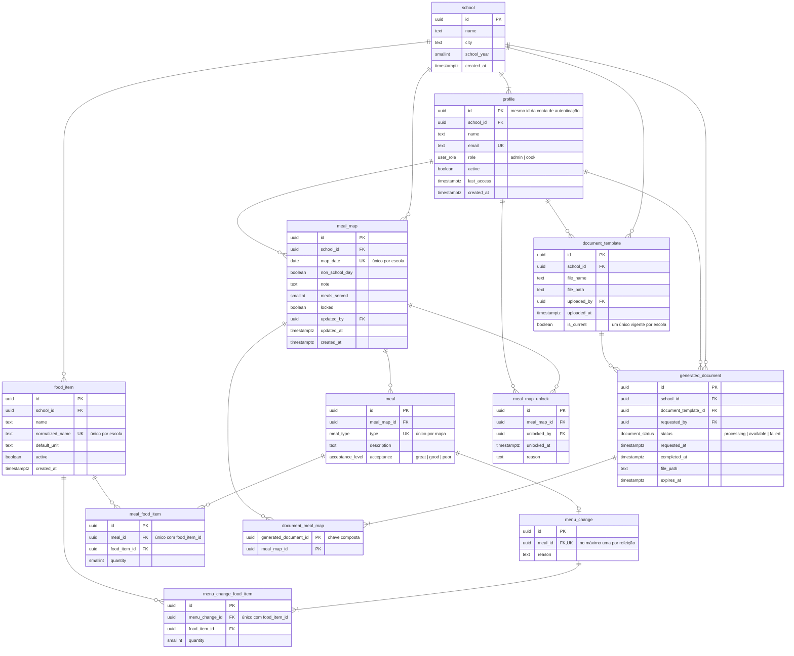

# Modelo ER — MAE

> Etapa E4 do projeto (refs #41). Terceiro artefato da modelagem: o modelo lógico, derivado do [modelo conceitual](modelo-conceitual.md). Aqui já existem tabelas, chaves primárias e estrangeiras, tipos de dado e restrições — na forma que o PostgreSQL vai receber. O SQL propriamente dito, com as políticas de acesso, é o [projeto físico](projeto-fisico.md).
>
> **É aqui que o modelo passa a falar inglês.** O diagrama de classes e o modelo conceitual usam o vocabulário do domínio, o mesmo das histórias e das telas; deste documento em diante, identificadores de tabela, coluna e tipo são em inglês, no singular, porque é com o código que eles vão conviver — ver [decisão 13](decisoes-de-modelagem.md). O conteúdo continua em português: nomes de gêneros, descrições das refeições, justificativas e toda a interface. O [glossário no fim desta página](#glossário-domínio--banco) liga um vocabulário ao outro.

## Diagrama

## Tipos enumerados

| Tipo | Valores | Domínio | Origem |
|---|---|---|---|
| `user_role` | `admin`, `cook` | administrador, merendeira | RN#1 da US016 |
| `meal_type` | `morning_snack`, `lunch`, `afternoon_snack` | lanche da manhã, almoço, lanche da tarde | RN#1 da US001 |
| `acceptance_level` | `great`, `good`, `poor` | ótimo, bom, ruim | CA#2 da US004 |
| `document_status` | `processing`, `available`, `failed` | em processamento, disponível, falhou | [Decisão 10](decisoes-de-modelagem.md) |

Valor de enumeração é estrutura, não conteúdo: vai para o inglês junto com o resto do schema, e a interface o traduz na exibição. Os estados do dia (vazio, pendente, completo, não letivo, no documento) **não** viram tipo do banco — são calculados na leitura ([decisão 4](decisoes-de-modelagem.md)).

A unidade padrão do gênero é `text`, não enumeração — a interface sugere as comuns, mas a lista não é fechada, porque o catálogo é das merendeiras ([decisão 8](decisoes-de-modelagem.md)). Ela guarda a palavra em português, como a merendeira a cadastrou: é conteúdo.

## As tabelas, uma a uma

### `school`

Raiz de todas as demais. `school_year` é `smallint` porque é um ano de calendário. **US015.**

### `profile`

Estende a conta do serviço de autenticação: `id` é o mesmo identificador, a tabela não duplica a conta ([decisão 2](decisoes-de-modelagem.md)). O nome segue a convenção do próprio Supabase — e `user` é palavra reservada no PostgreSQL, o que descarta o nome óbvio. `email` é único e existe aqui para a tela de gestão listar as merendeiras sem consultar o serviço de autenticação a cada linha. Desativar é `active = false`; a linha nunca é removida, porque mapas, documentos e desbloqueios apontam para ela.

### `food_item`

`normalized_name` é o nome em minúsculas e sem espaços repetidos, mantido pelo próprio banco a partir de `name`. É ele que carrega a unicidade por escola — sem isso, "Arroz" e "arroz " entrariam como itens diferentes quando as duas merendeiras cadastrassem o mesmo gênero de aparelhos diferentes ([decisão 9](decisoes-de-modelagem.md)). A chave estrangeira em `meal_food_item` é restritiva: gênero em uso não pode ser apagado, só desativado (CA#3 da US009).

### `meal_map`

Único por `(school_id, map_date)` — é a restrição que garante um mapa por dia. `locked` é o único estado armazenado ([decisão 4](decisoes-de-modelagem.md)). `updated_by` e `updated_at` sustentam a convergência entre aparelhos (CA#3 da US011). Duas restrições de coerência do dia:

- dia não letivo tem `note` e não tem `meals_served`;
- dia letivo não tem `note` de dia não letivo, e `meals_served`, quando informado, é positivo (CA#2 da US005).

Apagar um mapa remove em cascata refeições, alterações e gêneros utilizados — o dia é uma unidade só ([decisão 9](decisoes-de-modelagem.md)). Mapa incluído em documento não pode ser apagado: a chave estrangeira em `document_meal_map` é restritiva.

### `meal`

Única por `(meal_map_id, type)`: cada dia tem no máximo uma de cada refeição. `description` e `acceptance` aceitam nulo — um registro pode ficar parcial (CA#3 da US001), e "preenchida" é derivação, não restrição. `description` guarda o **cardápio previsto** e permanece fiel a ele mesmo quando houve troca ([decisão 7](decisoes-de-modelagem.md)).

### `menu_change`

`meal_id` é único: no máximo uma alteração por refeição. `reason` é `not null` e texto livre — é a RN#1 da US002 escrita no banco, e cobre a modificação inteira. **Não há coluna para o item substituído**: o formulário oficial não o pede.

### `meal_food_item`

Tabela que resolve o muitos-para-muitos entre refeição e gênero, com o atributo que ele carregava. Única por `(meal_id, food_item_id)` — o mesmo gênero não entra duas vezes na mesma refeição; `quantity` é `smallint` positiva (RN#1 da US003), porque são inteiros pequenos, nunca frações. Alimenta a coluna GÊNEROS UTILIZADOS do documento, consolidada por dia na geração.

### `menu_change_food_item`

A mesma estrutura, ligada à alteração: os gêneros e quantidades usados na troca. Única por `(menu_change_id, food_item_id)`. Alimenta a coluna "em caso de alterações, descreva os gêneros utilizados e as quantidades". As duas tabelas são separadas porque no documento são duas colunas distintas — juntá-las numa só, com uma marca dizendo a qual coluna pertence, tornaria anulável a coluna que carrega a distinção e complicaria a restrição de unicidade sem ganhar nada.

### `document_template`

Um índice único parcial sobre `school_id`, restrito às linhas com `is_current = true`, garante **exatamente uma versão vigente por escola** (RN#1 da US015) sem impedir que as anteriores continuem guardadas. `file_path` aponta para o balde privado do armazenamento; o arquivo nunca entra no repositório nem fica público (RNF#1 da US012).

### `generated_document`

Nasce em `processing` quando a merendeira pede, e o servidor a move para `available` ou `failed`. `completed_at`, `file_path` e `expires_at` só existem depois de concluída. Quando o arquivo expira, a linha permanece e a lista mostra "fora do ar" (CA#3 da US021). `document_template_id` registra com qual modelo o documento saiu.

### `document_meal_map`

Ligação pura entre a geração e os mapas incluídos, com chave primária composta pelas duas colunas. É dela que derivam o período (menor e maior data) e a quantidade de mapas exibidos na lista de documentos gerados — nenhum dos dois é coluna ([decisão 10](decisoes-de-modelagem.md)).

### `meal_map_unlock`

Somente inserção: nada aqui é editado ou apagado (RNF#1 da US023). `reason` é `not null` (CA#1 da US023). Um mapa "reaberto para correção" é aquele que tem ao menos uma linha aqui e está com `locked = false`.

## O que o banco garante e o que fica para a aplicação

| Regra | Onde vive | Como |
|---|---|---|
| Um mapa por dia, por escola | Banco | Índice único `(school_id, map_date)`. |
| Uma refeição de cada tipo por mapa | Banco | Índice único `(meal_map_id, type)`. |
| Um gênero não se repete na refeição | Banco | Índice único `(meal_id, food_item_id)`. |
| Um gênero não se repete na alteração | Banco | Índice único `(menu_change_id, food_item_id)`. |
| No máximo uma alteração por refeição | Banco | Índice único `(meal_id)` em `menu_change`. |
| Nome de gênero único na escola | Banco | Índice único `(school_id, normalized_name)`. |
| Quantidade inteira e positiva | Banco | `smallint` + `check (quantity > 0)`. |
| Alteração sem justificativa não existe | Banco | `reason not null`. |
| Alteração sem gênero nenhum não descreve troca | Aplicação | O banco não exige linha-filha na inserção; verificado na gravação do dia. |
| Dia não letivo tem observação e não tem refeições contadas | Banco | `check` de coerência na linha. |
| Exatamente uma versão vigente do modelo | Banco | Índice único parcial em `is_current`. |
| Gênero em uso não pode ser excluído | Banco | Chave estrangeira restritiva. |
| Mapa bloqueado não aceita edição da merendeira | Banco | Políticas de acesso e gatilho — [projeto físico](projeto-fisico.md), [decisão 5](decisoes-de-modelagem.md). |
| Merendeira não escreve em `locked` | Banco | Política de acesso por coluna. |
| Merendeira só enxerga a própria escola | Banco | Políticas de acesso por perfil. |
| **Dia letivo tem exatamente três refeições** | Aplicação | O registro pode ficar parcial de propósito (CA#3 da US001); "as três preenchidas" é o critério de dia **completo**, verificado na leitura, não uma restrição de existência. |
| **Dia completo, pendente e vazio** | Aplicação | Derivados ([decisão 4](decisoes-de-modelagem.md)). |
| **Prevalece a edição mais recente** | Aplicação | Comparação de `updated_at` na gravação do dia (CA#3 da US011). |
| **Só mapas sincronizados entram no documento** | Aplicação | Verificado na geração (RN#3 da US012). |

## Glossário: domínio → banco

A tradução entre o vocabulário das histórias e o do schema. É esta tabela que mantém o rastreio entrevista → história → tela → classe → tabela, agora que os dois últimos passos falam idiomas diferentes.

| Domínio (histórias, telas, [classes](diagrama-de-classes.md)) | Tabela | Observação |
|---|---|---|
| Escola | `school` | — |
| Usuário (administrador, merendeira) | `profile` | Estende a conta do serviço de autenticação; `user` é reservada no PostgreSQL. |
| Gênero alimentício | `food_item` | Ganha `normalized_name` para a unicidade. |
| Mapa (do dia) | `meal_map` | Guarda o nome do artefato institucional — o mapa é o documento que dá nome ao MAE. Métodos `situacao()`, `completo()` e `reaberto()` viram derivação de leitura. |
| Refeição | `meal` | — |
| Alteração do cardápio | `menu_change` | Só o motivo; o item substituído não existe no formulário oficial. |
| Gênero utilizado | `meal_food_item` | Resolve o muitos-para-muitos refeição × gênero; vira a coluna GÊNEROS UTILIZADOS. |
| Gênero usado na troca | `menu_change_food_item` | Resolve alteração × gênero; vira a coluna "em caso de alterações". |
| Modelo oficial do documento | `document_template` | — |
| Documento gerado | `generated_document` | `periodo()` e `quantidadeMapas()` derivam de `document_meal_map`. |
| — | `document_meal_map` | Nasce aqui: resolve o muitos-para-muitos documento × mapa. |
| Desbloqueio de mapa | `meal_map_unlock` | — |

Doze tabelas para dez conceitos: as duas que não vêm do modelo conceitual — `menu_change_food_item` e `document_meal_map` — existem porque o banco não representa muitos-para-muitos diretamente.
