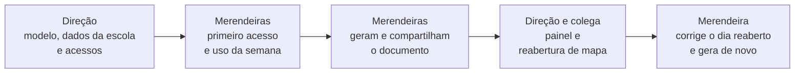

# Plano de testes da solução

> Etapa E7 (refs #137). Quem testa o MAE, o que cada pessoa testa e como o
> que acontecer vai ser registrado — escrito antes de alguém tocar no
> sistema, porque é o método descrito aqui que sustenta os relatos e os
> números do laudo de qualidade.

A E3 validou o **desenho**: as merendeiras viram as telas em imagem e
entenderam o fluxo ([validação com as
merendeiras](../03-ux/validacao-com-as-merendeiras.md)). A E5 e a E6
provaram que o **código** não quebra: testes de unidade, de componente, de
banco e o [teste de ponta a ponta](../05-web/teste-ponta-a-ponta.md) do
caminho crítico. Nenhum dos dois diz se o sistema serve para quem vai usá-lo.
É isso que esta etapa testa: o **uso**, com o aplicativo respondendo ao toque,
nas mãos de quem faz o mapa de verdade.

## Quem testa

| Testador | Perfil | Plataforma | O que testa |
|---|---|---|---|
| Merendeira 1 | merendeira | aplicativo Android | o fluxo do mapa, do primeiro acesso ao documento compartilhado |
| Merendeira 2 | merendeira | aplicativo Android | o mesmo fluxo, no aparelho dela |
| Direção | administrador | web | os acessos, o modelo oficial, o painel e a reabertura de mapa |
| Colega | administrador | web | o fluxo da direção, com o olhar de quem não conhece a escola |

**O fluxo da merendeira só é testado por merendeira.** O aplicativo foi feito
para uma rotina específica — o cardápio da semana, as trocas de última hora,
o número de refeições que chega das professoras. Quem não vive essa rotina
executa as tarefas sem entender o que está registrando, e o teste sai falso:
mede a interface contra alguém que nunca vai usá-la. O colega, por isso,
testa só o lado da direção, que é gerencial e não depende da cozinha.

**Por que quatro, e não cinco.** A atividade pede cinco colegas. O curso é a
distância e não há colegas de turma ao alcance para um teste presencial; em
vez de completar o número com pessoas sem relação com o problema, o teste foi
montado em torno de quem vai usar o sistema. As duas merendeiras são **todas
as usuárias do aplicativo** nesta escola — não uma amostra, a população
inteira — e a direção é a usuária para quem o painel existe.

## Antes dos testes

Nenhuma testadora encontra o sistema sem que o caminho inteiro já tenha
rodado no ambiente publicado:

1. **Ensaio geral** (#139): o caminho completo, web e aplicativo, percorrido
   no sistema publicado — do acesso criado pela direção ao documento aberto no
   Word Online —, com os registros do aparelho, do navegador e do servidor
   colhidos no mesmo dia.
2. **Varredura técnica** (#140): o que o ensaio revelou, mais os avisos de
   segurança e desempenho do banco, as dependências e o contraste das cores.
   O que for risco é corrigido antes; o resto entra no laudo como achado
   interno.
3. **Sistema zerado** (#141): o que o ensaio criou é apagado, e a escola
   começa os testes do jeito que começaria o uso — só com a direção.

## Como os testes acontecem

Os testes rodam no **sistema publicado** — a web no endereço de produção e o
aplicativo da última release —, com o **mapa real da semana corrente**. Não
há ambiente de teste com dados inventados: o cardápio é o que a nutricionista
mandou, as trocas são as que aconteceram, o número de refeições é o do dia.

A ordem segue a do próprio sistema, porque cada passo depende do anterior:

- **A direção cria os acessos.** O teste das merendeiras começa pelo e-mail
  que a criação de acesso dispara — o mesmo caminho que elas teriam no uso.
- **O ritmo é o da escola.** O uso acontece no tempo delas, em meio à rotina
  da cozinha; não há prazo para concluir as tarefas, e é esse o uso que
  interessa observar.
- **Primeiro contato acompanhado.** A instalação, a criação da senha e o
  primeiro dia registrado acontecem com alguém do projeto ao lado, **sem
  ajudar**: só anotando onde a pessoa hesita, erra ou pergunta. Se ela
  travar de vez, a ajuda vem, e o travamento é o achado.
- **Conversa de fechamento.** Depois de gerar e compartilhar o documento, uma
  conversa curta e aberta com cada testador, nos campos da tabela da
  faculdade.

## O roteiro

As tarefas são **objetivos, não instruções**: diz-se o que fazer, nunca onde
tocar. Uma tarefa que vem com o caminho junto testa a capacidade de seguir
instruções, não a interface.

### Merendeira — aplicativo

| # | Tarefa | Histórias |
|---|---|---|
| M1 | Instalar o aplicativo a partir do arquivo recebido no WhatsApp | — |
| M2 | Criar a senha e entrar | US016 |
| M3 | Registrar o dia de hoje | US001, US004, US005 |
| M4 | Registrar os gêneros usados e as quantidades | US003, US009 |
| M5 | Se algo do cardápio mudou, registrar a troca e o motivo | US002 |
| M6 | Se houver dia sem aula, registrá-lo | US006 |
| M7 | Corrigir um dia já registrado | US007 |
| M8 | Saber o que ainda falta registrar na semana | US008 |
| M9 | Gerar o documento da semana e mandá-lo no WhatsApp | US012, US013, US014 |
| M10 | Mandar de novo um documento já gerado | US021 |
| M11 | Corrigir um dia reaberto pela direção e gerar o documento outra vez | US023 |

A falta de internet **não é tarefa**: a escola não tem sinal, e o registro
sem rede (US010, US011) acontece sozinho no uso. O que se observa é se ela
percebe alguma diferença — e se precisaria perceber.

### Direção e colega — web

| # | Tarefa | Histórias |
|---|---|---|
| D1 | Conferir os dados da escola e enviar o modelo oficial do mapa | US015 |
| D2 | Dar acesso às merendeiras | US016 |
| D3 | Acompanhar o mês no painel: aceitação, refeições servidas, merendas mais bem aceitas | US017 |
| D4 | Reabrir um dia já incluído em documento, com a justificativa | US023 |
| D5 | Tirar o acesso de alguém e devolvê-lo | US016 |

D1 e D2 são da direção, porque abrem o teste das merendeiras. D3 e D4 são
feitos pela direção e pelo colega, depois que existe um mês registrado e um
documento gerado. D5 fica para o fim, numa conta que não esteja em uso —
tirar o acesso de uma merendeira no meio da semana interromperia o teste
dela.

## A medição de tempo

Além do relato, um número: **quanto tempo leva registrar um dia** — no
processo de hoje e no aplicativo.

- **O que se mede:** o registro completo de um dia — as três refeições, a
  aceitação, os gêneros e o número de refeições —, do início da tarefa até o
  dia estar preenchido.
- **Como:** cronômetro, na sessão acompanhada, com o mesmo dia registrado
  das duas formas pela mesma merendeira.
- **Quando:** depois de alguns dias de uso, e não no primeiro contato — no
  primeiro contato se mede o aprendizado, não o registro.
- **O que se guarda:** só os números e a descrição do que estava sendo
  feito. Não há gravação de tela, imagem ou vídeo: o que sustenta o número é
  este método, descrito antes da medição.

## Como os achados são registrados

- **Os campos da tabela da faculdade**, por testador: data do teste, o que
  testou e funcionou, o que testou e não funcionou, e o que não foi testado.
- **Cada achado vira issue no dia em que aparece**, com a label `bug` (algo
  não funciona como deveria) ou `melhoria` (funciona, mas atrapalha o uso), e
  a origem declarada no texto: *"Teste da E7 — Merendeira 1, 14/10"*. Achado
  deixado para o fim perde o contexto de quando aconteceu.
- **O que é corrigido.** O que impede ou atrapalha o uso é corrigido nesta
  etapa e volta para o testador conferir, numa versão nova do aplicativo. O
  que for pedido novo, que o produto não prometia, entra no backlog com a
  origem declarada — e o laudo diz qual foi o caminho de cada achado.

## Regra das evidências

As evidências do laudo são capturas de tela e anotações, e passam por uma
regra só: **o que é publicado não identifica ninguém.**

- Nomes, e-mails e qualquer dado pessoal aparecem trocados por fictícios ou
  tarjados. As testadoras são *Merendeira 1*, *Merendeira 2*, *Direção* e
  *Colega* em todo documento público.
- O nome da escola e da prefeitura não aparecem.
- **O documento oficial gerado nunca entra no repositório**, nem em captura:
  ele carrega o símbolo e o nome da prefeitura. O que o laudo mostra dele é a
  tela do aplicativo que o gerou.
- O cardápio, os gêneros e as quantidades não identificam ninguém e podem
  aparecer como foram registrados.

## O que sai desta etapa

- O **relato dos testes**, testador por testador, nos campos da faculdade.
- O **laudo de qualidade**: cada erro encontrado, a correção e a evidência de
  antes e depois — dos testes com as pessoas, do ensaio e da varredura
  técnica —, junto do que os testes automatizados garantem a cada mudança.
